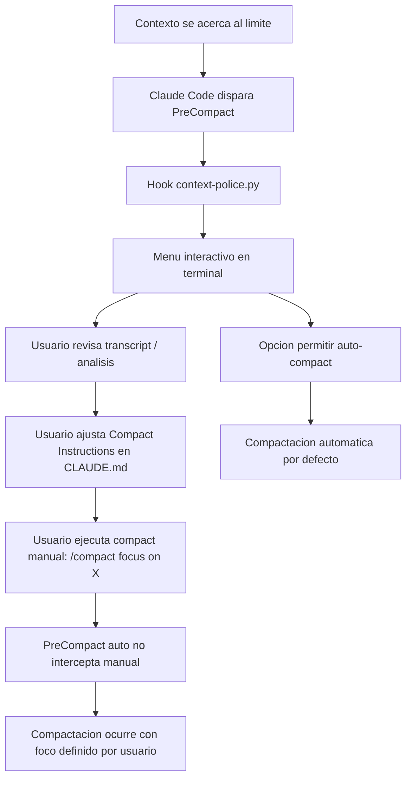
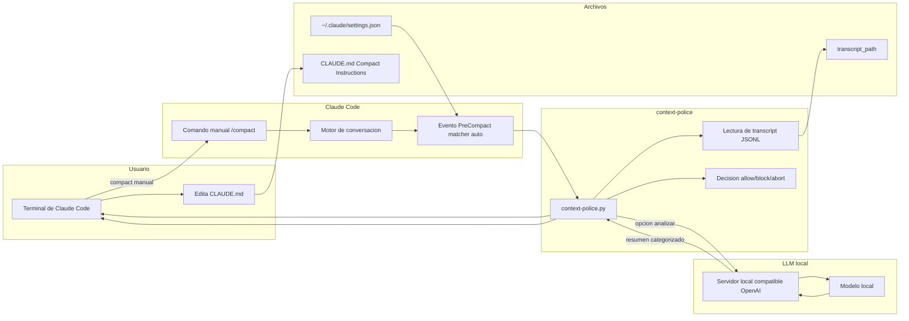

# Diagramas de la solución

Abajo tenés dos diagramas:
- Flujo de decisión antes de compactar.
- Arquitectura y conexión con LLM local.

## 1) Flujo de compaction con intervención del usuario

## 2) Diagrama de arquitectura (incluye LLM local)

Si tu visor no renderiza Mermaid, podés previsualizar este archivo en Markdown Preview de VS Code.
